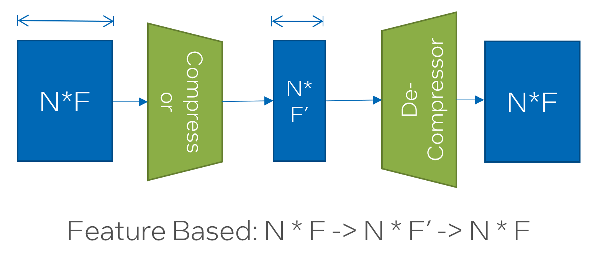

.. _sar-compression:

SAR's compression-decompression modules
===========================================
SAR can reduce the communication overhead of distributed GNN training during remote neighbor aggregation by incorporating the compression-decompression module.
Let's assume we have two clients --- Client1 and Client2. Moreover, Client2 needs the node features of nodes a, b, and, c from Client1 
to compute embedding of it's local nodes d and e. To reduce the communication cost, SAR compression-decompression module will compress the nodes a, b, and, c on Client1 side using a
learnable compression module and decompress it on the Client2 side using a learnable decompression module.

.. image:: ./images/comp_decomp_overview.png
    :alt: SAR compression-decompression
    :width: 1000 px

There are three different modes for compression-decompression:

.. contents:: :local:
    :depth: 2

Mode 1: Feature-based compression-decompression
------------------------------------------------------------------------------
In this mode, SAR uses an autoencoder architecture to learn a latent embedding for the sending nodes (a, b, c) with size determined by the compression ratio. The encoder (compressor) projects each node feature vector to 
the latent space and the decoder (decompressor) projects it back to the original size.

