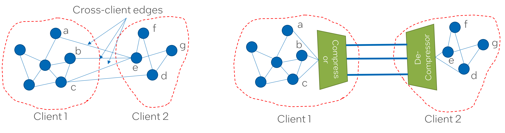
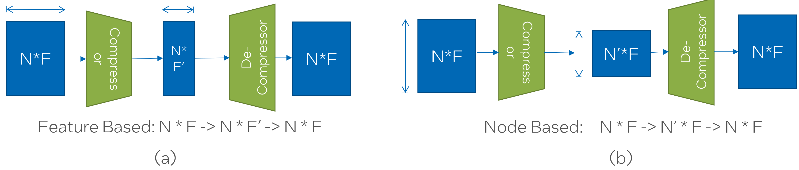
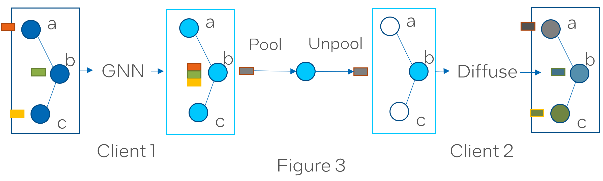

.. _sar-compression:

SAR's compression-decompression modules
===========================================
SAR can reduce the communication overhead of distributed GNN training during remote neighbor aggregation by incorporating the compression-decompression module.
Let's assume we have two clients --- Client1 and Client2. Moreover, Client2 needs the node features of nodes a, b, and, c from Client1 
to compute embedding of it's local nodes d and e. To reduce the communication cost, SAR compression-decompression module will compress the nodes a, b, and, c on Client1 side using a
learnable compression module and decompress it on the Client2 side using a learnable decompression module.

Currently, the compression-decompression module is implemented only for :ref:`One-shot aggregation` mode. 
So you should first extract the full partition graph from the :class:`sar.core.GraphShardManager` object and 
then attach a compression decompression module to it.
::

  partition_data = sar.load_dgl_partition_data(
     json_file_path, #Path to .json file created by DGL's partition_graph
     rank, #Worker rank
     device #Device to place the partition data (CPU or GPU)
  )
  shard_manager = sar.construct_full_graph(partition_data)
  one_shot_graph = shard_manager.get_full_partition_graph()        # extract one-shot graph
  compression_module = ...                                         # define compression module here (3 possible options)
  one_shot_graph._compression_decompression = compression_module   # attach compression module with one shot graph
  model_out = gnn_model(one_shot_graph, local_node_features)
  loss_function(model_out).backward()

..

There are three different modes for compression-decompression:

.. contents:: :local:
    :depth: 2

Mode 1: Feature-based compression-decompression
------------------------------------------------------------------------------
In this mode (Figure 2a), SAR uses an autoencoder architecture to learn a latent embedding for the sending nodes (a, b, c) with size determined by the compression ratio. The encoder (compressor) projects each node feature vector (size :math:`F`) to 
the latent space (size :math:`F'`) and the decoder (decompressor) projects it back to the original size.

Use :class:`sar.core.compressor.FeatureCompressorDecompressor` with the original feature dimension (:math:`F`) the desired compression ratio (:math:`F/F'`).
The original feature is a list of integers corresponding to input dimension of each layer of GNN. Similary, the compression ratio is also a list corresponding to 
compression ratio for each layer. This enables the use of different compression ratio for different layers.

::

    feature_dim = [features.size(1)] + [args.layer_dim] * (args.n_layers - 2) + [num_labels]
    compression_ratio = [float(args.comp_ratio)] * args.n_layers   # Using same ratio for every layer but you can change it vary across layers.
    compression_module = FeatureCompressorDecompressor(
                            feature_dim = feature_dim,
                            comp_ratio = comp_ratio
                        )

..

Mode 2: Node-based compression-decompression
--------------------------------------------------------------------------------
In this mode (Figure 2b), The sending client (Client1) selects a subset of nodes (Say only two out of a, b, c)
that it needs to send and the receiving client (Client2) replaces the missing nodes with 0. It consists 
of a ranking module which ranks the node based on their feature using a one-layer neural network.
Then it selects a fraction (1 / compression_ratio) of the nodes based on their ranking. The compression ratio can be
fixed or variable over training iterations. This whole ranking and selection process is similar
to pooling operator in Graph-UNet (https://github.com/HongyangGao/Graph-U-Nets/blob/master/src/utils/ops.py#L64).

One advantage of this module over feature-based compression is that you can use variable compression ratio during
training time. For example, you can send fewer nodes during the initial epochs and continuously increase the
amount as training progresses. One reason you might want to do that is because during the initial epochs the 
node embeddings are noisy and unstable and probably don't contain a lot of information. However, as you train, these
embeddings become more stable and informative. So, it might be benificial to save some bandwith initially and use it
at the later stages.

Use :class:`NodeCompressorDecompressor` for the node-based compression. The feature dimension is
used in the same way as feature-based compression. However, the compression ratio is a single value instead of a list. 
To enable variable compression ratio across training epochs, use :math:`enable_vcr=True`
and specifiy the :math:`step`. :math:`step` is the number of epochs after which compression ratio changes based on a exponentially decaying function.

::

    feature_dim = [features.size(1)] + [args.layer_dim] * (args.n_layers - 2) + [num_labels]
    compression_ratio = float(args.comp_ratio)
    compression_module = NodeCompressorDecompressor(
                            feature_dim=feature_dim,
                            comp_ratio=comp_ratio,
                            step=32,
                            enable_vcr=True
                        )

..

Mode 3: Subgraph-based compression-decompression
------------------------------------------------------------------
This mode is similar to the node-based compression expect that it has learnable compressor module and a smarter decompression module. 
This compressor first passes the node features through a GNN using the induced subgraph of the sending nodes (a, b, c). Then it uses a ranking module to pool a subset of node representation 
and sends them. The advantage of this module over node-based is that this is better in terms of privacy since it aggregates
the node-features to learn a sub-graph representation instead of directly sharing these nodes.
Note that this operation is only applied to the first layer processing of GNN since we don't share direct node features in the subsequent layers.
So for the subsequent layers this works as a node-based compressor.

Upon receiving, the remote client (Client2) diffuses these representation using the same induced subgraph structure to interpolate the missing node-features.
Note that in node-based compressor, we don't do anything for the missing nodes (we just replace them by 0). Instead here, we are
interpolating these missing features by applying max-pool operation across the neighbors of a particular node.

The improved compression and decompressor scheme helps this module to gain similar performance as feature-based
compressor while having more privacy benefit compared to feature-based. Use :class:`SubgraphCompressorDecompressor`
for subgraph-based compression.

::

    feature_dim = [features.size(1)] + [args.layer_dim] * (args.n_layers - 2) + [num_labels]
    compression_ratio = float(args.comp_ratio)
    compression_module = SubgraphCompressorDecompressor(
                        feature_dim=feature_dim,
                        full_local_graph=one_shot_graph,
                        indices_required_from_me=one_shot_graph.indices_required_from_me,
                        tgt_node_range=one_shot_graph.tgt_node_range,
                        comp_ratio=args.comp_ratio
                )
..