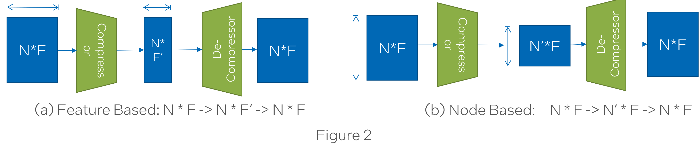

.. _sar-compression:

SAR's compression-decompression modules
===========================================
SAR can reduce the communication overhead of distributed GNN training during remote neighbor aggregation by incorporating the compression-decompression module.
Let's assume we have two clients --- Client1 and Client2. Moreover, Client2 needs the node features of nodes a, b, and, c from Client1 
to compute embedding of it's local nodes d and e. To reduce the communication cost, SAR compression-decompression module will compress the nodes a, b, and, c on Client1 side using a
learnable compression module and decompress it on the Client2 side using a learnable decompression module.

.. image:: ./images/comp_decomp_overview.png
    :alt: SAR compression-decompression
    :width: 1000 px

Currently, the compression-decompression module is implemented only for :ref:`One-shot aggregation` mode. 
So you should first extract the full partition graph from the :class:`sar.core.GraphShardManager` object and 
then attach a compression decompression module to it.
::

  partition_data = sar.load_dgl_partition_data(
     json_file_path, #Path to .json file created by DGL's partition_graph
     rank, #Worker rank
     device #Device to place the partition data (CPU or GPU)
  )
  shard_manager = sar.construct_full_graph(partition_data)
  one_shot_graph = shard_manager.get_full_partition_graph()
  compression_module = ...   # define compression module here
  one_shot_graph._compression_decompression = compression_module
  model_out = gnn_model(one_shot_graph, local_node_features)
  loss_function(model_out).backward()

..

There are three different modes for compression-decompression:

.. contents:: :local:
    :depth: 2

Mode 1: Feature-based compression-decompression
------------------------------------------------------------------------------
In this mode (Figure 2a), SAR uses an autoencoder architecture to learn a latent embedding for the sending nodes (a, b, c) with size determined by the compression ratio. The encoder (compressor) projects each node feature vector (size :math:`F`) to 
the latent space (size :math:`F'`) and the decoder (decompressor) projects it back to the original size.

