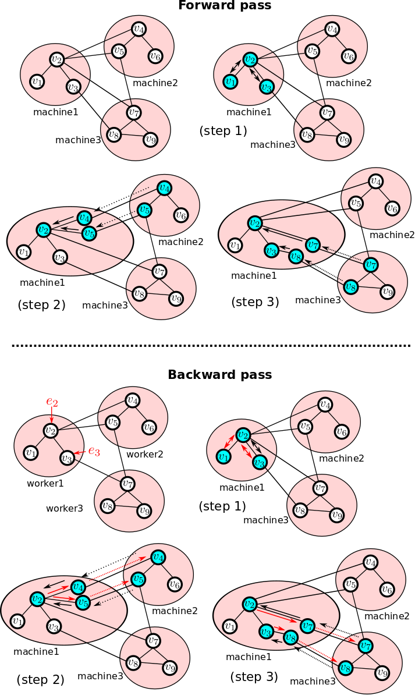
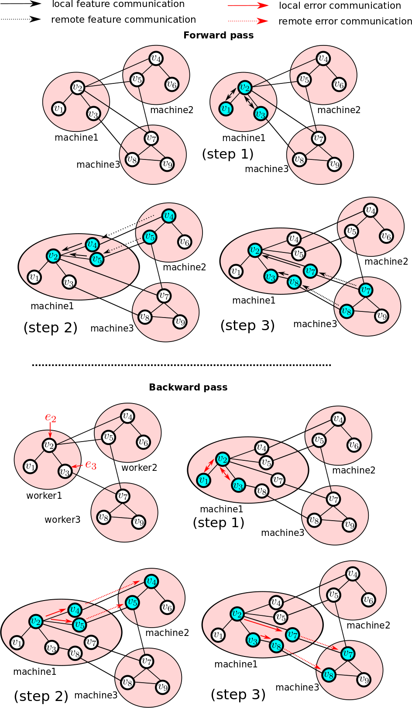
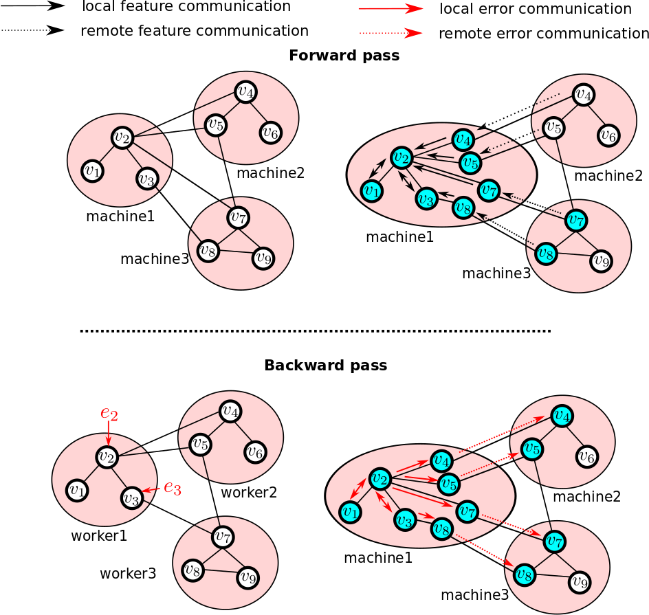

.. _sar-modes:

SAR's training modes
=============================
SAR can run the distributed GNN forward and backward pass in three distinct modes: 

.. contents:: :local:
    :depth: 2

Mode 1: Sequential aggregation and rematerialization
------------------------------------------------------------------------------------
SAR's main training mode uses sequential aggregation and rematerialization to avoid fully materializaing the computational graph at any single worker. The distributed training scheme is illustrated below for 3 workers/partitions. The figure illustrates the forward and backward pass steps for machine/worker 1.

**Forward pass:**: When doing distributed message passing and aggregation, all workers disable PyTorch's autgrad to stop PyTorch from creating the computational graph. The forward pass steps in worker 1 are:

#. Aggregates messages from nodes in the local partition.
#. Fetch neighboring node features from worker 2 and aggregates their messages. Delete fetched nodes.
#. Fetch neighboring node features from worker 3 and aggregates their messages. Delete fetched nodes.

**Backward pass:**: Since no computational graph was constructed in the forward pass, the workers need to reconstruct the computational graph to backpropagate the gradients. The backward pass steps in worker 1 when worker one receives errors :math:`e_2,e_3` for nodes :math:`v_2,v_3`: 

#.  Re-aggregate messages from nodes in the local partition with autograd enabled, backpropagate along the constructed computational graph, then delete all intermediate tensors to delete the computational graph.
#.  Re-fetch neighboring nodes from worker 2 and re-aggregate their messages with autograd enabled, backpropagate along the constructed computational graph, then delete all intermediate tensors to delete the computational graph.
#.  Re-fetch neighboring nodes from worker 3 and re-aggregate their messages with autograd enabled, backpropagate along the constructed computational graph, then delete all intermediate tensors to delete the computational graph.

Note that many GNN layer simply use a sum or mean operation to aggregate the features of their neighbors. In that case, we do not need to reconstruct the computational graph during the backward pass, as the gradients of the input features can be easily obtained from the gradients of the output features. To see that consider the operation :math:`z = x + y`, and assume we have the gradient of the loss w.r.t :math:`z`:  :math:`e_z` than the gradients of the loss w.r.t x and y are :math:`e_x = e_y = e_z`. SAR automatically detects this situation and directly pushes the correct gradients to the local and remote nodes without re-fetching remote features or re-construting the computational graph.
   
Mode 1 is the default mode. It runs automatically when you pass a :class:`sar.core.GraphShardManager` object to your GNN model. For example:
::
   
    partition_data = sar.load_dgl_partition_data(
        json_file_path, #Path to .json file created by DGL's partition_graph
        rank, #Worker rank
        device #Device to place the partition data (CPU or GPU)
    )
    shard_manager = sar.construct_full_graph(partition_data)
    model_out = gnn_model (shard_manager,local_node_features)
    loss_function(model_out).backward()
    
.. 

Mode 1 is the most memory-efficient mode. Excluding the GNN parameters which are replicated across all workers, mode 1 guarantees that peak memory consumption per worker will go down linearly with the number of workers used in training, even for densely connected graphs. 
            
Mode 2: Sequential aggregation
------------------------------------------------------------------------------------
For many GNN layers, mode 1 must sequentially rematerialize the computational graph during the backwrd pass. This is the case for GAT layers for example. This introduces extra communication overhead during the backward pass in order to re-fetch the features of remote nodes. It also  introduces an extra compute overhead in order to sequentially construct the computational graph (by re-executing the forward pass with autograd enabled).

Mode 2 avoids this overhead by constructing the computational graph during the forward pass. This can potentially take up a lot of memory. In a densely connected graph for example, this may cause the features of all nodes in the graph to be materialized at every worker. The figure below illustrates the forward and backward pass in mode 2. Only the activity in worker 1 is shown. Note that remote node featues are stored in worker 1 during the forward pass as part of the computational graph at worker 1. In the backward pass, SAR has access to the full computational graph and it uses it to backpropagates gradients to remote nodes without any re-fetching.

Mode 2 can be enabled by disabling sequential rematerialization in SAR's configuration object :class:`sar.Config`.::

  sar.Config.disable_sr  = True
  partition_data = sar.load_dgl_partition_data(
    json_file_path, #Path to .json file created by DGL's partition_graph
    rank, #Worker rank
    device #Device to place the partition data (CPU or GPU)
  )
  shard_manager = sar.construct_full_graph(partition_data)
  model_out = gnn_model (shard_manager,local_node_features)
  loss_function(model_out).backward()
    
.. 

Mode 3: One-shot aggregation
------------------------------------------------------------------------------------
Modes 1 and 2 follow a sequential aggregation approach where data from remote partitions are sequentially fetched. This might introduce scalability issues since the forward and backward pass in each layer will involve N communication rounds each (where N is the number of workers/partitions). Sequential aggregation thus introduces N synchronization points in each layer's forward and backward passes as each worker needs to wait until every other worker has finished its aggregation step before moving to the next step in the aggregation sequence (See the steps in the figure above).

In mode 3, the one-shot aggregation mode, each worker fetches all remote data in one communication round and does one aggregation round to aggregate message from all remotely fetched nodes.  This is illustrated in the figure below:

One advantage of mode 3 is that it only requires one communication round per layer in each of the forward and backward passes. One disadvantage is that mode 3 does not hide the communication latency. Due to the sequential nature of modes 1 and 2, SAR is able to simultaneously process data from one remote partition while pre-fetching data from the next remote partition in the aggregation sequence. Modes 1 and 2 can thus better hide the communication latency than mode 3. The memory requirements of mode 3 are similar to mode 2.

To train in mode 3, you should extract the full partition graph from the :class:`sar.core.GraphShardManager` object and use that during training.
::
   
  partition_data = sar.load_dgl_partition_data(
     json_file_path, #Path to .json file created by DGL's partition_graph
     rank, #Worker rank
     device #Device to place the partition data (CPU or GPU)
  )
  shard_manager = sar.construct_full_graph(partition_data)
  one_shot_graph = shard_manager.get_full_partition_graph()
  model_out = gnn_model (one_shot_graph,local_node_features)
  loss_function(model_out).backward()
  
.. 
